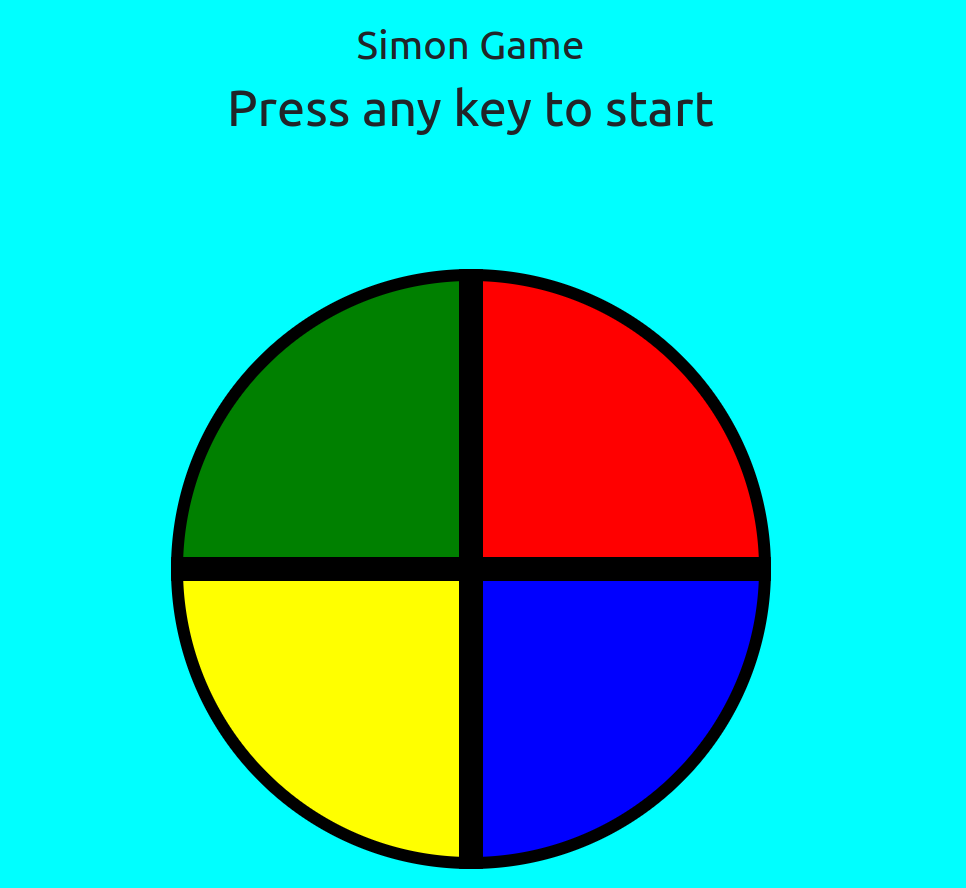

# Simon Game

A web-based version of the classic Simon memory game built with HTML, CSS, Bootstrap, and jQuery.



## Description

Simon Game is a digital recreation of the popular electronic memory game from the 1980s. The game tests the player's memory by creating a series of tones and lights that the player must repeat. The sequence gets longer with each successful round, increasing the difficulty.

## Features

- Classic Simon gameplay with four colored buttons (red, green, blue, yellow)
- Progressive difficulty as sequences get longer
- Visual feedback with flashing colors
- Audio feedback with distinct tones for each button
- Score tracking to monitor your progress
- Responsive design that works on desktop

## Technologies Used

- HTML5
- CSS3
- Bootstrap 5 (for responsive layout and styling)
- jQuery (for DOM manipulation and game logic)

## How to Play

1. Press any key to start the game
2. Watch and listen as the game shows a sequence of colored buttons
3. Repeat the sequence by clicking the buttons in the same order
4. If you get the sequence right, you'll advance to the next level with a longer sequence
5. If you make a mistake, the game will end, and you can start again

## Installation

1. Clone the repository:
   ```
   https://github.com/palashshrote/simon-plays.git
   ```
2. Open `index.html` in your web browser

## Live Demo

[Play the game online](https://palashshrote.github.io/simon-plays/)

## Project Structure

```
simon-game/
├── index.html
├── illustration.png
├── styles.css
├── index.js
├── sounds/
│   ├── blue.mp3
│   ├── green.mp3
│   ├── red.mp3
│   ├── yellow.mp3
│   └── wrong.mp3
└── README.md
```

## Future Enhancements (Let's collaborate)

- Add a strict mode option
- Implement high score tracking
- Add customizable difficulty levels
- Create themes with different sounds and visuals

## Contributing

Contributions are welcome! Please feel free to submit a Pull Request.

## Acknowledgments

- Inspired by the classic Simon game by Milton Bradley
- Special thanks to Angela Yu(The Complete Full-Stack Web Development Bootcamp) for the guidance